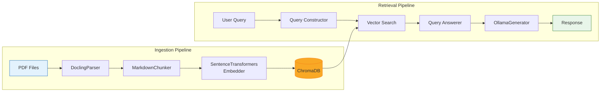

<p align="center">
  <h1 align="center">Open-Books</h1>
  <p align="center">
    <strong>A local RAG system for chatting with your technical PDF library</strong>
  </p>
</p>

<p align="center">
  
  
  
  
  
</p>

---

<p align="center">
  
  <br>
  <em>Open-Books TUI in action — chat with your technical library directly from the terminal.</em>
</p>

---

## Overview

**Open-Books** is a fully local Retrieval-Augmented Generation (RAG) application designed to ingest technical PDF books and enable natural language querying through an elegant Terminal User Interface (TUI). 

Built for developers, researchers, and technical professionals who want to leverage their personal PDF library as a knowledge base—without sending data to external servers.

### Key Features

- **Fully Local** — Your documents and queries never leave your machine
- **PDF Ingestion** — Intelligent parsing using Docling with table/formula extraction
- **Semantic Search** — Vector-based retrieval with sentence-transformers embeddings
- **Conversational Interface** — Beautiful TUI powered by Textual
- **Smart Syncing** — Hash-based incremental indexing (only re-process changed files)
- **Configurable** — YAML-based configuration for all components

---

## Architecture

The system is built around two main pipelines: **Ingestion** (document processing) and **Retrieval** (query answering).



### Pipeline Details

| Stage | Component | Description |
|-------|-----------|-------------|
| **Parsing** | `DoclingParser` | Extracts text, tables, and formulas from PDFs with structure preservation |
| **Chunking** | `MarkdownChunker` | Splits documents into semantic chunks respecting section boundaries |
| **Embedding** | `SentenceTransformersEmbedder` | Generates 384-dim vectors using `all-MiniLM-L6-v2` |
| **Storage** | `ChromaStore` | Persistent vector storage with metadata filtering |
| **Retrieval** | `SimpleRAGPipeline` | Coordinates search and answer generation |
| **Generation** | `OllamaGenerator` | Local LLM inference via Ollama |

---

## Tech Stack

### Core

| Technology | Purpose |
|------------|---------|
| **Python 3.11+** | Runtime |
| **uv** | Fast package manager and resolver |
| **Pydantic** | Configuration validation and settings management |
| **Typer** | CLI framework |

### Data & ML

| Technology | Purpose |
|------------|---------|
| **ChromaDB** | Persistent vector database |
| **Docling** | PDF parsing with structure extraction |
| **sentence-transformers** | Text embedding models |
| **Ollama** | Local LLM serving (llama3.2 default) |

### Observability & Caching

| Technology | Purpose |
|------------|---------|
| **Opik** | ML observability and tracing |
| **Redis + RedisVL** | Semantic caching for repeated queries |
| **Loguru** | Structured logging |

### User Interface

| Technology | Purpose |
|------------|---------|
| **Textual** | Modern TUI framework |
| **Rich** | Terminal formatting and tables |

---

## Installation

### Prerequisites

- Python 3.11 or higher
- [Ollama](https://ollama.ai/) installed and running
- (Optional) Redis for semantic caching

### Steps

1. **Clone the repository**
   ```bash
   git clone https://github.com/your-username/open-books.git
   cd open-books
   ```

2. **Install uv** (if not already installed)
   ```bash
   curl -LsSf https://astral.sh/uv/install.sh | sh
   ```

3. **Install dependencies**
   ```bash
   uv sync
   ```

4. **Start Ollama and pull the default model**
   ```bash
   ollama serve  # In a separate terminal
   ollama pull llama3.2
   ```

5. **Configure the application** (optional)
   
   Edit `config/config.yaml` to customize settings. See [Configuration](#configuration) for details.

---

## Usage

### Adding Books

Place your PDF files in the `books/` directory:

```bash
cp /path/to/your/book.pdf books/
```

### Syncing the Library

Index your books into the vector store:

```bash
uv run python main.py sync
```

This command will:
- Scan the `books/` folder for PDFs
- Parse new/modified files using Docling
- Chunk and embed the content
- Store vectors in ChromaDB
- Update the manifest to track file hashes

### Checking Library Status

View information about indexed books:

```bash
uv run python main.py info
```

### Launching the Chat TUI

Start the interactive terminal interface:

```bash
uv run python main.py chat
```

**TUI Keybindings:**

| Key | Action |
|-----|--------|
| `q` | Quit application |
| `d` | Toggle dark/light mode |
| `s` | Toggle sidebar (book list) |
| `Ctrl+L` | Clear chat history |
| `PageUp/Down` | Scroll messages |

---

## Project Structure

```
open-books/
├── main.py                    # Application entry point
├── pyproject.toml             # Project metadata and dependencies
├── uv.lock                    # Locked dependency versions
├── config/
│   └── config.yaml            # Application configuration
├── books/                     # Drop PDFs here for indexing
├── data/
│   └── chroma_db/             # Persisted vector storage
├── logs/                      # Application logs
├── src/
│   ├── cli.py                 # Typer CLI commands (sync, info, chat)
│   ├── ingestion/             # Data Processing Pipeline
│   │   ├── parsers/           # PDF parsing (DoclingParser, MarkerParser)
│   │   ├── chunking/          # Text chunking strategies
│   │   ├── embedding/         # Vector embedding (sentence-transformers)
│   │   ├── indexer/           # Library management and sync logic
│   │   └── vector_store/      # ChromaDB and Redis store wrappers
│   ├── generation/            # RAG Logic
│   │   ├── generator.py       # LLM interfaces (OllamaGenerator)
│   │   ├── query_constructor.py # Multi-query expansion
│   │   ├── answerer.py        # Context-based answer generation
│   │   └── pipeline.py        # RAG pipeline orchestration
│   ├── retrieval/             # Search utilities
│   ├── ui/                    # Terminal User Interface
│   │   ├── app.py             # Textual RAGApp main class
│   │   └── widgets.py         # Custom message widgets
│   ├── shared/                # Shared models and types
│   └── utils/                 # Configuration and logging
└── tests/                     # Pytest test suite
```

---

## Configuration

All settings are managed via `config/config.yaml`. Below is the configuration schema with defaults:

### Parsing

```yaml
parsing:
  parser: docling              # Options: docling, marker
  extract_images: true         # Extract diagrams/figures
  extract_tables: true         # Extract tables as structured data
  ocr_enabled: false           # Enable OCR for scanned PDFs (slow)
```

### Chunking

```yaml
chunking:
  strategy: markdown_based     # Options: markdown_based, semantic
  chunk_size: 512              # Target tokens per chunk
  chunk_overlap: 50            # Overlap between chunks
  respect_boundaries: true     # Never split across sections
  min_chunk_size: 100          # Discard chunks smaller than this
  max_chunk_size: 1024         # Hard maximum size
  preserve_code_blocks: true   # Keep code as atomic chunks
  preserve_equations: true     # Keep equations with context
```

### Embedding

```yaml
embedding:
  provider: sentence_transformers
  model_name: all-MiniLM-L6-v2  # HuggingFace model ID
  dimensions: 384               # Must match model output
  device: cpu                   # Options: cpu, cuda, mps
  batch_size: 32
```

### Vector Store

```yaml
vector_store:
  client_path: /path/to/data/chroma_db
  collection_name: technical_books
```

### LLM

```yaml
llm:
  provider: ollama              # Options: ollama, openai
  model_name: llama3.2          # Model to use
  api_key: null                 # Required for OpenAI
  base_url: http://localhost:11434  # Ollama server URL
  temperature: 0.1              # Response creativity (0-1)
```

### Redis (Optional Caching)

```yaml
redis:
  host: localhost
  port: 6379
  cache_threshold: 0.1          # Semantic similarity threshold
```

---

## Development

### Running Tests

```bash
uv run pytest
```

Run with coverage:

```bash
uv run pytest --cov=src
```

### Skip Slow Tests

```bash
uv run pytest -m "not slow"
```

---

## License

This project is open source. See `LICENSE` for details.

---

<p align="center">
  Built for knowledge seekers
</p>
